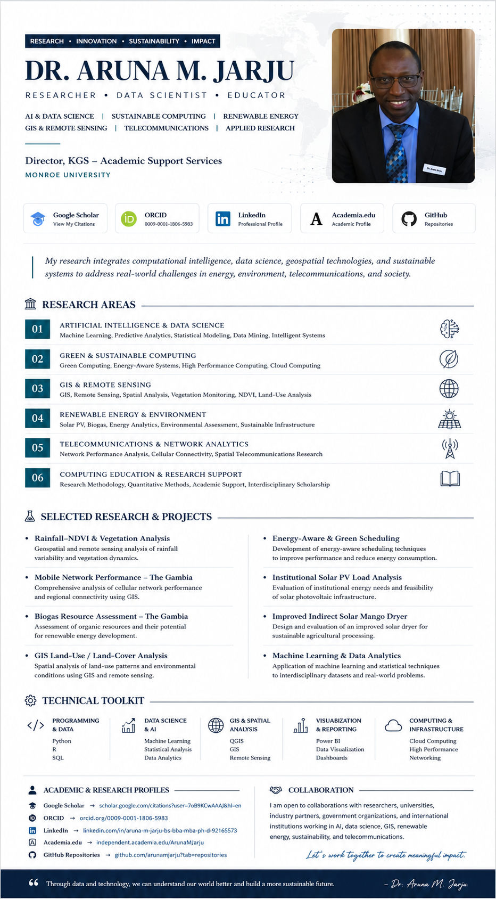

  

<!-- ========================================================= -->
<!--             DR. ARUNA M. JARJU | GITHUB PROFILE           -->
<!-- ========================================================= -->

  

  

<h1 align="center">Dr. Aruna M. Jarju</h1>

  <strong>Researcher · Data Scientist · Educator</strong>

  Director, <strong>KGS – Academic Support Services</strong> 
  Monroe University

  

 

  
  
  
  
  
  

 

  
  
  
  

---

## About Dr. Jarju

### Research at the intersection of data, technology, and sustainability

Dr. Aruna M. Jarju is a researcher, data scientist, and educator whose work connects
<strong>Artificial Intelligence, Data Science, Sustainable Computing, Renewable Energy,
GIS, Remote Sensing, Telecommunications, and Applied Research.</strong>

His research applies computational and data-driven methods to practical challenges in
<strong>energy, environment, telecommunications, agriculture, intelligent systems, and sustainable development.</strong>

He currently serves as <strong>Director of KGS – Academic Support Services at Monroe University</strong>,
supporting academic research, quantitative analysis, technology education, interdisciplinary scholarship,
and research development.

 

  <strong>DATA → INSIGHT → INNOVATION → IMPACT</strong>

---

## Research in Focus

**Three major interdisciplinary research streams**

 

  
  &nbsp;
  
  &nbsp;
  

 

<table>
<tr>

<td width="33%" valign="top">

### AI & Data Science

Machine learning, predictive analytics, statistical modeling, intelligent systems, and data-driven decision support.

`Machine Learning`  
`Data Science`  
`Predictive Analytics`  
`Statistical Analysis`

</td>

<td width="33%" valign="top">

### GIS & Earth Observation

GIS, remote sensing, vegetation monitoring, environmental analysis, NDVI, and spatial intelligence.

`GIS`  
`QGIS`  
`Remote Sensing`  
`NDVI`

</td>

<td width="33%" valign="top">

### Sustainable Technology

Green computing, renewable energy, energy efficiency, and sustainable infrastructure.

`Green Computing`  
`Solar PV`  
`Biogas`  
`Sustainability`

</td>

</tr>
</table>

 

<strong>Explore additional research domains</strong>

 

### Telecommunications & Network Analytics
Network performance, cellular connectivity, geospatial network analysis, and telecommunications research.

### Computing Education & Academic Research
Research methodology, quantitative methods, academic research support, technology education, and interdisciplinary scholarship.

### Environmental & Climate Analytics
Rainfall variability, vegetation dynamics, land-use analysis, and environmental data interpretation.

---

## Featured Research & Projects

**Applied research · Data-driven methods · Sustainable impact**

 

### Rainfall–NDVI & Vegetation Analysis

Geospatial and remote-sensing research examining rainfall variability, vegetation dynamics, and environmental conditions.

`GIS` · `NDVI` · `Remote Sensing` · `Environmental Analytics`

---

### Energy-Aware & Green Scheduling

Computational research focused on improving system performance while reducing energy consumption and environmental impact.

`Green Computing` · `HPC` · `Optimization` · `Energy Efficiency`

---

### Mobile Network Performance — The Gambia

Quantitative and geospatial analysis of cellular network performance, regional connectivity, and telecommunications infrastructure.

`Telecommunications` · `Network Analytics` · `GIS`

---

### Institutional Solar PV Load Analysis

Assessment of institutional energy demand and opportunities for sustainable photovoltaic infrastructure.

`Solar PV` · `Energy Analytics` · `Sustainability`

---

### Biogas Resource Assessment — The Gambia

Investigation of organic resources and their potential contribution to renewable-energy development.

`Biogas` · `Renewable Energy` · `Resource Assessment`

---

### Improved Indirect Solar Mango Dryer

Applied renewable-energy research combining solar technology, agriculture, engineering, and sustainable post-harvest preservation.

`Solar Energy` · `Agriculture` · `Applied Research`

---

### GIS Land-Use / Land-Cover Analysis

Application of geospatial methods for understanding land-use patterns, environmental conditions, and geographic change.

`GIS` · `Spatial Analysis` · `Remote Sensing`

---

### Machine Learning & Data Analytics

Application of statistical and machine-learning approaches to interdisciplinary research problems and real-world datasets.

`Machine Learning` · `Data Science` · `Analytics`

---

## Research & Technical Toolkit

### Programming & Data

  

### Artificial Intelligence & Analytics

  

### GIS & Environmental Intelligence

  

### Visualization & Computing

---

## Research Framework

### Artificial Intelligence & Machine Learning

↓

### Data Science & Analytics

↓

### GIS · Environment · Energy · Telecommunications

↓

### Interdisciplinary Applied Research

↓

## Sustainable Real-World Impact

---

## Academic & Professional Profiles

*Publications, scholarly identity, and professional connections.*

 

  

  

---

## Research Collaboration

### Open to interdisciplinary research and academic collaboration

I welcome collaboration with **researchers, universities, students, industry partners, government organizations, and international institutions**.

 

 

  

   

---

### Research · Innovation · Sustainability

**Advancing interdisciplinary research through data-driven and computational approaches.**

 

