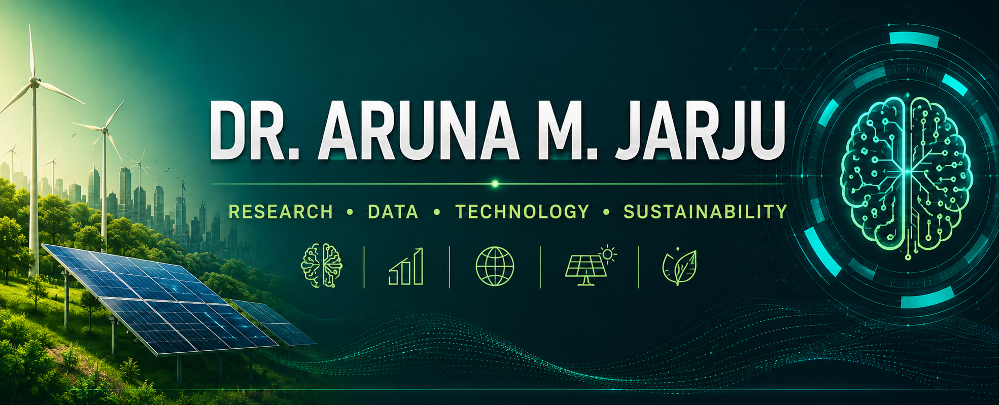

<!-- ========================================================= -->

<!--        DR. ARUNA M. JARJU | PROFESSIONAL GITHUB PROFILE   -->

<!-- ========================================================= -->

  

  <strong>AI & DATA SCIENCE</strong> &nbsp; • &nbsp;
  <strong>SUSTAINABLE COMPUTING</strong> &nbsp; • &nbsp;
  <strong>RENEWABLE ENERGY</strong> &nbsp; • &nbsp;
  <strong>GIS & REMOTE SENSING</strong>

  <strong>Director, KGS – Academic Support Services · Monroe University</strong>

 

<!-- ===================== NAVIGATION ===================== -->

  
  
  
  
  
  

 

<!-- ===================== PROFILE LINKS ===================== -->

 

<h2 align="center">👤 &nbsp; ABOUT DR. JARJU</h2>

Researcher · Data Scientist · Educator

Dr. Aruna M. Jarju works at the intersection of Artificial Intelligence, Data Science, Sustainable Computing, Renewable Energy, GIS, Remote Sensing, Telecommunications, and Applied Research.

His research focuses on developing data-driven and computational solutions for real-world challenges involving energy efficiency, environmental sustainability, telecommunications, agriculture, intelligent systems, and sustainable development.

He currently serves as Director of KGS – Academic Support Services at Monroe University, supporting academic research, quantitative analysis, interdisciplinary scholarship, technology education, and research development.

Research philosophy: Transform data into knowledge, knowledge into innovation, and innovation into meaningful impact.

 

📊 DATA → 💡 INSIGHT → ⚙️ INNOVATION → 🌍 IMPACT

<h2 align="center">🔬 &nbsp; RESEARCH PORTFOLIO</h2>

Interdisciplinary research connecting computing, data, sustainability, and real-world applications

 

<table>

<tr>

<td width="33%" align="center" valign="top">

🤖

AI & Data Science

Machine learning, predictive analytics, statistical modeling, intelligent systems, and data-driven decision support.

 

Machine Learning

Data Science

Predictive Analytics

Statistics

</td>

<td width="33%" align="center" valign="top">

🛰️

GIS & Remote Sensing

Spatial analytics, Earth observation, NDVI, land-use analysis, vegetation monitoring, and environmental intelligence.

 

GIS

QGIS

Remote Sensing

NDVI

</td>

<td width="33%" align="center" valign="top">

☀️

Renewable Energy

Solar PV, biogas resources, energy analytics, sustainable infrastructure, and environmental sustainability.

 

Solar Energy

Solar PV

Biogas

Sustainability

</td>

</tr>

</table>

 

<table>

<tr>

<td width="33%" align="center" valign="top">

🌱

Green Computing

Energy-aware computing, computational efficiency, resource optimization, and sustainable high-performance computing.

Green Computing

HPC

Optimization

</td>

<td width="33%" align="center" valign="top">

📡

Telecommunications

Cellular connectivity, network performance, telecommunications infrastructure, and spatial network analysis.

Network Analytics

Connectivity

Telecommunications

</td>

<td width="33%" align="center" valign="top">

🎓

Computing Education

Technology education, quantitative methods, academic research support, and interdisciplinary scholarship.

Research Methods

Education

Academic Support

</td>

</tr>

</table>

 

<strong>🔎 Explore Research Areas in Detail</strong>

 

🤖 Artificial Intelligence & Machine Learning

Machine learning, intelligent systems, statistical learning, predictive modeling, and computational approaches for decision support.

📊 Data Science & Analytics

Statistical analysis, predictive analytics, data visualization, quantitative research, and evidence-based decision-making.

🛰️ GIS & Earth Observation

Geospatial analysis, remote sensing, NDVI, vegetation monitoring, environmental assessment, and land-use research.

🌱 Sustainable Computing

Green computing, energy-aware systems, cloud computing, high-performance computing, and computational optimization.

☀️ Renewable Energy

Solar photovoltaic systems, biogas resources, institutional energy assessment, and sustainable infrastructure.

📡 Telecommunications

Network performance analysis, cellular connectivity, regional telecommunications systems, and spatial network research.

 

<h2 align="center">🚀 &nbsp; SELECTED RESEARCH & PROJECTS</h2>

Applied Research · Computational Methods · Sustainable Impact

 

<table>

<tr>

<td width="50%" valign="top">

<h3 align="center">🌿 Rainfall–NDVI & Vegetation Analysis</h3>

Geospatial and remote-sensing research examining relationships among rainfall variability, vegetation dynamics, and environmental conditions.

Research Methods

GIS · NDVI · Remote Sensing

</td>

<td width="50%" valign="top">

<h3 align="center">⚡ Energy-Aware & Green Scheduling</h3>

Computational research focused on improving system performance while reducing energy consumption and environmental impact.

Research Methods

Green Computing · HPC · Optimization

</td>

</tr>

<tr>

<td width="50%" valign="top">

<h3 align="center">📡 Mobile Network Performance — The Gambia</h3>

Quantitative and geospatial investigation of cellular network performance, regional connectivity, and telecommunications infrastructure.

Research Methods

Telecommunications · GIS · Analytics

</td>

<td width="50%" valign="top">

<h3 align="center">☀️ Institutional Solar PV Load Analysis</h3>

Assessment of institutional energy demand and opportunities for sustainable photovoltaic infrastructure.

Research Methods

Solar PV · Energy Analytics

</td>

</tr>

<tr>

<td width="50%" valign="top">

<h3 align="center">♻️ Biogas Resource Assessment — The Gambia</h3>

Investigation of organic resources and their potential contribution to renewable-energy development.

Research Methods

Biogas · Renewable Energy

</td>

<td width="50%" valign="top">

<h3 align="center">🌾 Improved Indirect Solar Mango Dryer</h3>

Applied renewable-energy research combining solar technology, agriculture, engineering, and post-harvest preservation.

Research Methods

Solar Energy · Agriculture

</td>

</tr>

<tr>

<td width="50%" valign="top">

<h3 align="center">🗺️ GIS Land-Use / Land-Cover Analysis</h3>

Application of geospatial methods for understanding land-use patterns, environmental conditions, and geographic change.

Research Methods

GIS · Spatial Analysis · Remote Sensing

</td>

<td width="50%" valign="top">

<h3 align="center">🧠 Machine Learning & Data Analytics</h3>

Application of statistical and machine-learning techniques to interdisciplinary datasets and real-world research problems.

Research Methods

Machine Learning · Data Science

</td>

</tr>

</table>

 

<h2 align="center">🛠️ &nbsp; RESEARCH & TECHNICAL TOOLKIT</h2>

💻 Programming & Data

  

🤖 Artificial Intelligence & Analytics

  

🗺️ GIS & Environmental Intelligence

  

📊 Visualization & Computing

 

<h2 align="center">🌍 &nbsp; RESEARCH FRAMEWORK</h2>

🤖 Artificial Intelligence & Machine Learning

⬇

📊 Data Science & Analytics

⬇

🛰️ GIS · ☀️ Energy · 🌱 Environment · 📡 Telecommunications

⬇

🔬 Interdisciplinary Applied Research

⬇

🌍 Sustainable Real-World Impact

 

<h2 align="center">📌 &nbsp; CURRENT RESEARCH INTERESTS</h2>

<table>

<tr>

<td width="50%" valign="top">

🤖 AI for decision support

📊 Predictive analytics

🌱 Energy-efficient computing

☀️ Renewable-energy analytics

🛰️ GIS & Earth observation

</td>

<td width="50%" valign="top">

🌦️ Climate & vegetation analytics

📡 Telecommunications

🌾 Sustainable agriculture technology

☁️ Cloud & high-performance computing

🎓 Computing education

</td>

</tr>

</table>

<h2 align="center">🎓 &nbsp; ACADEMIC & PROFESSIONAL PROFILES</h2>

📚 Explore Publications · Research · Professional Activity

 

  

  

 

<h2 align="center">🤝 &nbsp; RESEARCH COLLABORATION</h2>

🌐 Open to interdisciplinary and international research collaboration

I welcome opportunities to collaborate with researchers, universities, students, industry partners, government organizations, and international institutions.

 

 

  

 

🌍 Research · Innovation · Sustainability · Impact

Advancing interdisciplinary research through data-driven and computational approaches.

 

