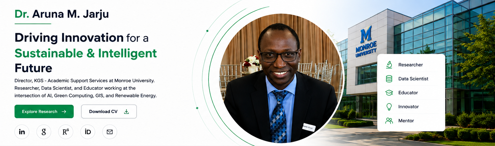

<!--
  Dr. Aruna M. Jarju — GitHub Profile README
  Upload this README.md and the assets folder to:
  https://github.com/arunamjarju/arunamjarju
-->

  

  <a href="#about"><b>About</b></a>&nbsp;&nbsp;•&nbsp;&nbsp;
  <a href="#research"><b>Research</b></a>&nbsp;&nbsp;•&nbsp;&nbsp;
  <a href="#publications"><b>Publications</b></a>&nbsp;&nbsp;•&nbsp;&nbsp;
  <a href="#books"><b>Books</b></a>&nbsp;&nbsp;•&nbsp;&nbsp;
  <a href="#projects"><b>Projects</b></a>&nbsp;&nbsp;•&nbsp;&nbsp;
  <a href="#experience"><b>Experience</b></a>&nbsp;&nbsp;•&nbsp;&nbsp;
  <a href="#profiles"><b>Profiles</b></a>&nbsp;&nbsp;•&nbsp;&nbsp;
  <a href="#contact"><b>Contact</b></a>

  
  
  
  

About Me

<table>
<tr>
<td width="62%" valign="top">

Dr. Aruna M. Jarju

Researcher · Data Scientist · Educator
Director, KGS – Academic Support Services · Monroe University

I work at the intersection of Artificial Intelligence, Data Science, Sustainable Computing, Renewable Energy, GIS, Remote Sensing, Telecommunications, and Applied Research.

My research uses computational, quantitative, and geospatial methods to address practical challenges in sustainability, energy, environmental intelligence, telecommunications, agriculture, and technology-enabled decision making.

DATA → KNOWLEDGE → INNOVATION → IMPACT

</td>
<td width="38%" valign="top">

Professional Focus

🔬 Researcher

📊 Data Scientist

🎓 Educator

💡 Innovator

🤝 Research Mentor

🌍 Sustainability Researcher

</td>
</tr>
</table>

<a href="#top">↑ Back to top</a>

Research Areas

<table>
<tr>
<td width="33%" align="center" valign="top">
<h3>🧠 AI & Machine Learning</h3>
Deep learning, predictive analytics, statistical modeling, intelligent systems, and data-driven decision support.
  
<code>Machine Learning</code> <code>AI</code> <code>Predictive Analytics</code>
</td>

<td width="33%" align="center" valign="top">
<h3>🌱 Green Computing</h3>
Energy-aware computing, high-performance computing, computational efficiency, resource optimization, and sustainable digital infrastructure.
  
<code>Green Computing</code> <code>HPC</code> <code>Optimization</code>
</td>

<td width="33%" align="center" valign="top">
<h3>☀️ Renewable Energy</h3>
Solar photovoltaic systems, biogas resources, energy analytics, sustainable infrastructure, and renewable-energy applications.
  
<code>Solar Energy</code> <code>Biogas</code> <code>Sustainability</code>
</td>
</tr>

<tr>
<td width="33%" align="center" valign="top">
<h3>🌍 GIS & Remote Sensing</h3>
Earth-observation data, vegetation analysis, land-use assessment, environmental change, and spatial analytics.
  
<code>GIS</code> <code>QGIS</code> <code>NDVI</code>
</td>

<td width="33%" align="center" valign="top">
<h3>📈 Data Science & Big Data</h3>
Statistical analysis, predictive modeling, data visualization, quantitative research, and interdisciplinary analytics.
  
<code>Python</code> <code>R</code> <code>SQL</code>
</td>

<td width="33%" align="center" valign="top">
<h3>📡 Telecommunications</h3>
Cellular network performance, regional connectivity, geospatial network analysis, and telecommunications infrastructure.
  
<code>Network Analytics</code> <code>Connectivity</code> <code>GIS</code>
</td>
</tr>
</table>

<a href="#top">↑ Back to top</a>

Selected Research & Projects

<table>
<tr>
<td width="50%" valign="top">

🌧️ Rainfall–NDVI & Vegetation Analysis

Geospatial and remote-sensing research investigating rainfall variability, vegetation dynamics, land-use change, and environmental conditions.

Focus: GIS · NDVI · Remote Sensing · Environmental Analytics

⚡ Energy-Aware & Green Scheduling

Computational strategies designed to improve system performance while reducing energy consumption and environmental impact.

Focus: Green Computing · HPC · Optimization · Energy Efficiency

📶 Mobile Network Performance — The Gambia

Data-driven assessment of cellular network quality, regional connectivity, and telecommunications infrastructure using quantitative and spatial methods.

Focus: Telecommunications · Network Analytics · GIS

☀️ Institutional Solar PV Load Analysis

Assessment of institutional energy requirements and opportunities for solar photovoltaic systems and sustainable energy infrastructure.

Focus: Solar PV · Energy Analytics · Sustainable Infrastructure

</td>
<td width="50%" valign="top">

♻️ Biogas Resource Assessment — The Gambia

Investigation of organic resources and their potential contribution to renewable-energy generation and sustainable resource utilization.

Focus: Biogas · Renewable Energy · Sustainability

🥭 Improved Indirect Solar Mango Dryer

Applied research integrating renewable energy, agricultural technology, engineering, and sustainable post-harvest preservation.

Focus: Solar Energy · Agriculture · Applied Research

🗺️ GIS Land-Use / Land-Cover Analysis

Application of geospatial methods to understand land-use patterns, vegetation, environmental conditions, and geographic change.

Focus: GIS · Spatial Analysis · Remote Sensing

🤖 Machine Learning & Data Analytics

Application of statistical and machine-learning methods to interdisciplinary research challenges and real-world datasets.

Focus: Machine Learning · Data Science · Analytics

</td>
</tr>
</table>

<a href="#top">↑ Back to top</a>

Recent & Selected Publications

<table>
<tr>
<td width="68%" valign="top">

📄 Quantum Computing: The Next Frontier in Technology

Aruna M. Jarju · TechRxiv · 2025
View publication →

📄 Design, Development, and Performance Evaluation of an Improved Indirect Solar Mango Dryer for Sustainable Post-Harvest Preservation in The Gambia

Aruna M. Jarju · Journal of Climate Innovation and Technology · 2026
View publication →

📄 Logic Gates Design Principles, Operational Analysis, and Applications in Digital Systems

Aruna M. Jarju · Sahar Bukhari · Engineering and Technology Journal · 2026
View publication →

📄 AI-Driven Decision-Making in Organizations: Enhancing Executive Strategy, Mitigating Bias, and Navigating the Trust Deficit

Ebenezer Amakeh · Aruna M. Jarju · Sahar Bukhari · 2026
View publication →

📄 Rainfall Variability and Agricultural Production in the Lower River Region (Gambia): Case of Rice and Maize

Aruna M. Jarju · Boubacar Solly · Ebrima Sonko
View research record →

<a href="https://www.researchgate.net/profile/Aruna-Jarju"><b>View all research on ResearchGate →</b></a>

</td>
<td width="32%" valign="top">

📊 Research Profile

ResearchGate

18 publications

27,000+ reads

Research profile at Monroe University

Open ResearchGate →

🔎 Scholarly Search

Search Google Scholar →

🆔 ORCID

0009-0003-8657-934X →

</td>
</tr>
</table>

<a href="#top">↑ Back to top</a>

Books & Academic Work

My scholarly interests extend across computing, data science, information technology, sustainability, geospatial research, renewable energy, and interdisciplinary academic research.

For the most current list of books, chapters, publications, and research outputs, visit:

  
  

<a href="#top">↑ Back to top</a>

Academic Leadership & Experience

<table>
<tr>
<td width="50%" valign="top">

🎓 Monroe University

Director, KGS – Academic Support Services

Supporting academic research, quantitative analysis, interdisciplinary scholarship, technology education, research development, and student academic success.

Institutional focus

Research development

Data & quantitative analysis

Computing education

Academic support

Interdisciplinary scholarship

Research mentoring

</td>
<td width="50%" valign="top">

🌿 Journal of Climate Innovation and Technology

Research and scholarly activity spanning climate innovation, renewable energy, AI and data science, GIS and remote sensing, sustainability, and applied technology.

Visit JCIT →

🌍 West African Research & Development Institute

Interdisciplinary research in climate, GIS, renewable energy, agriculture, environmental sustainability, and development.

Visit WARDI →

</td>
</tr>
</table>

<a href="#top">↑ Back to top</a>

Technical & Research Toolkit

<table>
<tr>
<td width="25%" valign="top">

Programming & Data

Python
R
SQL

</td>
<td width="25%" valign="top">

Analytics & AI

Machine Learning
Statistical Analysis
Predictive Analytics
Data Visualization

</td>
<td width="25%" valign="top">

GIS & Spatial

QGIS
GIS
Remote Sensing
NDVI
Spatial Analysis

</td>
<td width="25%" valign="top">

Computing

Cloud Computing
High-Performance Computing
Networking
Green Computing

</td>
</tr>
</table>

Research Profiles & Professional Links

  
  
  

  
  
  

Collaboration & Contact

I welcome interdisciplinary collaboration with researchers, universities, students, industry partners, government agencies, and international organizations in areas including AI, data science, sustainability, GIS, renewable energy, telecommunications, and applied research.

  
  

  <b>MONROE UNIVERSITY</b>
  &nbsp;&nbsp;•&nbsp;&nbsp;
  <b>RESEARCHGATE</b>
  &nbsp;&nbsp;•&nbsp;&nbsp;
  <b>ORCID</b>
  &nbsp;&nbsp;•&nbsp;&nbsp;
  <b>GOOGLE SCHOLAR</b>
  &nbsp;&nbsp;•&nbsp;&nbsp;
  <b>JCIT</b>

  <i>Advancing interdisciplinary research through data-driven and computational approaches.</i>

<a href="#top">↑ Back to top</a>

